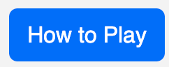
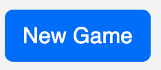

# 🍒Emoji Match

Emoji is a fun, logic game for everyone of all ages to use. It is based on a logic board game from the 1970s, called Mastermind. 

The Mastermind game involved two players, in which one of the players chose a sequence of coloured pegs, and the other player had to correctly deduce the sequence of coloured pegs in a certain number of guesses.

The player would be told if the pegs were in the right place, or told that the correct colour was present, but in the incorrect position.

Emoji Match is also based on another, more recent game - Wordle.

Emoji is an updated, digital version of the Mastermind game, where instead of a sequence of coloured pegs is used, a sequence of emojis are randomly chosen and can be played on a device rather than a board. 

Also, instead of coming up with a random word (like Wordle), it is a sequence of emojis that is needed, opening up the game to younger users.

The target audience could be anyone that can use a PC or a device such as a mobile phone or a tablet. Emoji Match offers a logic game that uses images rather than words, therfore the ability to spell is not a pre-requisite. But due to its puzzling nature, Emoji Match should also provide the challenge to those who like to keep the mind busy.

Here is a mockup image using the "Am I Responsive" website.
using the deployed site: [Emoji Match](https://ui.dev/amiresponsive?url=https://d3lyth.github.io/milestone_project2)

## UX

The design is based on a board game and the online game Wordle. It will contain the logo/title, buttons to check the instructions and to begin a new game. There will then be the 'gameboard' where emojis will appear. Below the gameboard a guess button will be placed and then an on-screen keyboard to be able to populate the gameboard tiles with emojis.

Below the gameboard are some credits and links to social media.

Users will also see the correct answer appear if they don't get the correct answer in 6 guesses or less, and the title will change to a 'GAME OVER' message. A 'well done' message will also appear if the user manages to guess the answer in 6 guesses or less.

### Colour Scheme

Due to the nature of the game and the colours of the emojis used, I have tried to keep the rest of the page quite neutral other than a pop of colour in the title/logo and the footer. I felt like too much colour on the background would make the page look too busy and effect accessibility.

- `#000000` has been used for primary text.
- `#fffff` has been used for button text.
- `#cd0ffc` has been used for instructional text, icons and ooter text.

I used [We Love Colours](https://www.welovecolors.com/) as inspiration to research a colour pallete, which although (other than the emojis themselves) doesn't have a lot of colour, I wanted to incoroprate a neon theme.

### Typography

The fonts were chosen for the Emoji Match game due to their fun nature. The game is supposed to appeal to all ages, therefore the playfulness aspect of the fonts needed to be showcased. 

- [Bungee Shade](https://fonts.google.com/specimen/Bungee+Shade) was used for the primary headers and titles. This font was chosen as it is a reminder of 'old school' or 'vintage' video games from the 80s.

- Classic emojis were used throughout. Emojis can look slightly different dependent on browser/operating systems/devices, but they are included using Unicode to ensure that the correct emoji is being used.

- [Roboto](https://fonts.google.com/specimen/Roboto) was used for all other secondary text.

- [Font Awesome](https://fontawesome.com) icons were used throughout the site, such as the social media icons in the footer.

## User Stories

🛑🛑🛑🛑🛑 ADD SCREENSHOTS??! 🛑🛑🛑🛑🛑

### New Site Users

- As a new site user, I would like to read the instructions, so that I can understand how to play the game.
- As a new site user, I would like to start a new game, so that I can play the game.
- As a new site user, I would like to be able to delete an emoji, so that I can change my guess if I have chosen the wrong emoji.
- As a new site user, I would like to click on guess, so that I can check to see whether my emoji guess is correct.
- As a new site user, I would like to see how my guess compares, so that I can make a new guess.
- As a new site user, I would like to see a well done message if correct, so that I know that I have completed the game.
- As a new site user, I would like to see the answer, so that I can see what I did wrong if I wasn't able to get the answer within the number of guesses allowed.

### Returning Site Users

- As a returning site user, I would like to read the instructions again, so that I can remind myslef how to play, if needed.
- As a returning site user, I would like to start a new game, so that I can have another go at guessing the emoji sequence.
- (As with a new site user) As a returning site user, I would like to be able to delete an emoji, so that I can change my guess if I have chosen the wrong emoji.
- (As with a new site user) As a returning site user, I would like to click on guess, so that I can check to see whether my emoji guess is correct.
- (As with a new site user) As a returning site user, I would like to see how my guess compares, so that I can make a new guess.
- (As with a new site user) As a returning site user, I would like to see a well done message if correct, so that I know that I have completed the game.
- (As with a new site user) As a returning site user, I would like to see the answer, so that I can see what I did wrong if I wasn't able to get the answer within the number of guesses allowed.

### Site Admin

- As a site administrator, I should be able to click on the social links in the footer, so that I can ensure that the links are working.
- As a site administrator, I should be able to click on the buttons, so that I can so that I na ensure that all buttons work.
- As a site administrator, I should be able to manage instruction information, so that I can update if required.

## Wireframes

To follow best practice, wireframes were developed for mobile, tablet, and desktop sizes.
I've used GoodNotes, and iPad and an Apple Pencil to design my site wireframes.

### Game Page Wireframes

| Size | Screenshot |
| --- | --- |
| Mobile |  |
| Tablet |  |
| Desktop |  |

## Features

⚠️⚠️⚠️⚠️⚠️ START OF NOTES (to be deleted) ⚠️⚠️⚠️⚠️⚠️

In this section, you should go over the different parts of your project,
and describe each in a sentence or so.

You will need to explain what value each of the features provides for the user,
focusing on who this website is for, what it is that they want to achieve,
and how your project is the best way to help them achieve these things.

For some/all of your features, you may choose to reference the specific project files that implement them.

IMPORTANT: Remember to always include a screenshot of each individual feature!

🛑🛑🛑🛑🛑 END OF NOTES (to be deleted) 🛑🛑🛑🛑🛑

### Existing Features

- **How to Play Button**

    - Details about this particular feature, including the value to the site, and benefit for the user. Be as detailed as possible!

- **New Game Button**

    - Details about this particular feature, including the value to the site, and benefit for the user. Be as detailed as possible!

- **Game Board**

    - Details about this particular feature, including the value to the site, and benefit for the user. Be as detailed as possible!

- **Emoji Keyboard**

    - Details about this particular feature, including the value to the site, and benefit for the user. Be as detailed as possible!

- **Clear Button**

    - Details about this particular feature, including the value to the site, and benefit for the user. Be as detailed as possible!

- **Backspace Button**

    - Details about this particular feature, including the value to the site, and benefit for the user. Be as detailed as possible!

- **Guess Button**

    - Details about this particular feature, including the value to the site, and benefit for the user. Be as detailed as possible!

- **'Well Done' message**

    - Details about this particular feature, including the value to the site, and benefit for the user. Be as detailed as possible!

- **'Correct Answer' message**

    - Details about this particular feature, including the value to the site, and benefit for the user. Be as detailed as possible!

### Future Features

- Different Themes
    - Currently, Emoji Match has a food theme. In a future feature, various themes can be included and the user would be able to choose the theme - this may be animals, emoji faces, flags etc. 
- Difficulty Level
    - In future versions, the user could have an option to choose an easy, medium or hard game. This could mean that the user can have more than 6 guesses to try and get the answer correct. Another way of changing the challenge could be that more or less emojis need to be matched.
- Scoreboard
    - A scoreboard can also be added to keep a tally of how many games the user have managed to win or lose.
    - The scoreboard could also include information like the average guesses that the user has made to get to the answer.
- Once a day game
    - Currently, the user can click on the new game button and the user can play over and over again.
    - The game can be modified to only allow one game a day and a winning streak can be recorded.
- Celebration
    - A celebratory confetti animation could be added for style purposes (and similarly a commiseration message animation).

## Tools & Technologies Used

- [HTML](https://en.wikipedia.org/wiki/HTML) used for the main site content.
- [CSS](https://en.wikipedia.org/wiki/CSS) used for the main site design and layout.
- [CSS Flexbox](https://www.w3schools.com/css/css3_flexbox.asp) used for an enhanced responsive layout.
- [CSS Grid](https://www.w3schools.com/css/css_grid.asp) used for an enhanced responsive layout.
- [JavaScript](https://www.javascript.com) used for user interaction on the site.
- [Git](https://git-scm.com) used for version control. (`git add`, `git commit`, `git push`)
- [GitHub](https://github.com) used for secure online code storage.
- [GitHub Pages](https://pages.github.com) used for hosting the deployed front-end site.
- [Gitpod](https://gitpod.io) used as a cloud-based IDE for development.
- [Bootstrap](https://getbootstrap.com) used as the front-end CSS framework for modern responsiveness and pre-built components.
- [Materialize](https://materializecss.com) used as the front-end CSS framework for modern responsiveness and pre-built components.

## Testing

For all testing, please refer to the [TESTING.md](TESTING.md) file.

## Deployment

The site was deployed to GitHub Pages. The steps to deploy are as follows:
- In the [GitHub repository](https://github.com/D3lyth/milestone_project2), navigate to the Settings tab 
- From the source section drop-down menu, select the **Main** Branch, then click "Save".
- The page will be automatically refreshed with a detailed ribbon display to indicate the successful deployment.

The live link can be found [here](https://d3lyth.github.io/milestone_project2)

### Local Deployment

This project can be cloned or forked in order to make a local copy on your own system.

#### Cloning

You can clone the repository by following these steps:

1. Go to the [GitHub repository](https://github.com/D3lyth/milestone_project2) 
2. Locate the Code button above the list of files and click it 
3. Select if you prefer to clone using HTTPS, SSH, or GitHub CLI and click the copy button to copy the URL to your clipboard
4. Open Git Bash or Terminal
5. Change the current working directory to the one where you want the cloned directory
6. In your IDE Terminal, type the following command to clone my repository:
	- `git clone https://github.com/D3lyth/milestone_project2.git`
7. Press Enter to create your local clone.

Alternatively, if using Gitpod, you can click below to create your own workspace using this repository.

Please note that in order to directly open the project in Gitpod, you need to have the browser extension installed.
A tutorial on how to do that can be found [here](https://www.gitpod.io/docs/configure/user-settings/browser-extension).

#### Forking

By forking the GitHub Repository, we make a copy of the original repository on our GitHub account to view and/or make changes without affecting the original owner's repository.
You can fork this repository by using the following steps:

1. Log in to GitHub and locate the [GitHub Repository](https://github.com/D3lyth/milestone_project2)
2. At the top of the Repository (not top of page) just above the "Settings" Button on the menu, locate the "Fork" Button.
3. Once clicked, you should now have a copy of the original repository in your own GitHub account!

### Local VS Deployment

⚠️⚠️⚠️⚠️⚠️ START OF NOTES (to be deleted) ⚠️⚠️⚠️⚠️⚠️

Use this space to discuss any differences between the local version you've developed, and the live deployment site on GitHub Pages.

🛑🛑🛑🛑🛑 END OF NOTES (to be deleted) 🛑🛑🛑🛑🛑

## Credits

⚠️⚠️⚠️⚠️⚠️ START OF NOTES (to be deleted) ⚠️⚠️⚠️⚠️⚠️

In this section you need to reference where you got your content, media, and extra help from.
It is common practice to use code from other repositories and tutorials,
however, it is important to be very specific about these sources to avoid plagiarism.

🛑🛑🛑🛑🛑 END OF NOTES (to be deleted) 🛑🛑🛑🛑🛑

### Content

Use this space to provide attribution links to any borrowed code snippets, elements, or resources.
A few examples have been provided below to give you some ideas.

| Source | Location | Notes |
| --- | --- | --- |
| [Markdown Builder](https://traveltimn.github.io/markdown-builder) | README and TESTING | tool to help generate the Markdown files |
| [W3Schools](https://www.w3schools.com/howto/howto_js_topnav_responsive.asp) | entire site | responsive HTML/CSS/JS navbar |
| [W3Schools](https://www.w3schools.com/howto/howto_css_modals.asp) | contact page | interactive pop-up (modal) |
| [Flexbox Froggy](https://flexboxfroggy.com/) | entire site | modern responsive layouts |
| [StackOverflow](https://stackoverflow.com/a/2450976) | quiz page | Fisher-Yates/Knuth shuffle in JS |

### Media

No media has been used for the site, other than teh emojis displayed. Unicode is used to show the emojis (in the title, the tiles, keyboard and 'well done' message). The images taken for the instructions modal are screen shots of the gameplay and compressed using TinyPNG.

| Source | Location | Type | Notes |
| --- | --- | --- | --- |
| [Pexels](https://www.pexels.com) | entire site | image | favicon on all pages |
| [TinyPNG](https://tinypng.com) | entire site | image | tool for image compression |

### Acknowledgements

- I would like to thank my Code Institute mentor, [Tim Nelson](https://github.com/TravelTimN) for their support throughout the development of this project. His patience and assistance has been invaluable.
- I would like to thank the [Code Institute](https://codeinstitute.net) tutor team for their assistance with troubleshooting and debugging some project issues.
- I would like to thank Iris Smok, our course facilitator for her support and encouragement.
- I would like to thank the [Code Institute Slack community](https://code-institute-room.slack.com) for the moral support; it kept me going during periods of self doubt and imposter syndrome.
- I would like to thank my partner Rob, for believing in me, and allowing me to make this transition into software development.
- I would like to thank my daughter Erin, for spending a lot of time playing and testing out the Emoji Match game to chekc for bugs and to give suggestions on the looks and feel of the game.
