# Testing

Return back to the [README.md](README.md) file.

## Code Validation

### HTML

I have used the recommended [HTML W3C Validator](https://validator.w3.org) to validate my HTML file. No errors have been returned.

| Page | W3C URL | Screenshot | Notes |
| --- | --- | --- | --- |
| Home | [W3C](https://validator.w3.org/nu/?doc=https%3A%2F%2FD3lyth.github.io%2Fmilestone_project2%2Findex.html) | 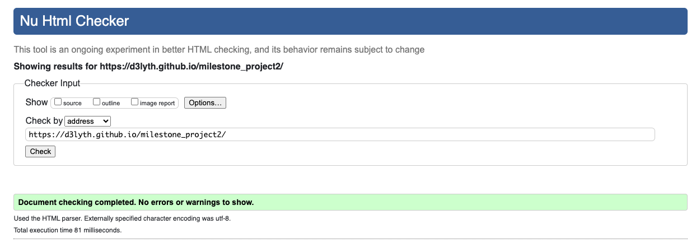 | Section lacks header h2-h6 warning |

### CSS

I have used the recommended [CSS Jigsaw Validator](https://jigsaw.w3.org/css-validator) to validate my CSS file. Due to the use of Bootstrap I have tested my code by direct input (copying the code into the validator) - no errors were detected.

| File | Jigsaw URL | Screenshot | Notes |
| --- | --- | --- | --- |
| style.css | [Jigsaw](https://jigsaw.w3.org/css-validator/validator?uri=https%3A%2F%2FD3lyth.github.io%2Fmilestone_project2) | 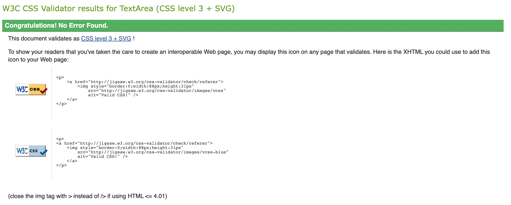 | Pass: No Errors |


### JavaScript

I have used the recommended [JShint Validator](https://jshint.com) to validate all of my JS files. No errors were found.

| File | Screenshot | Notes |
| --- | --- | --- |
| main.js | 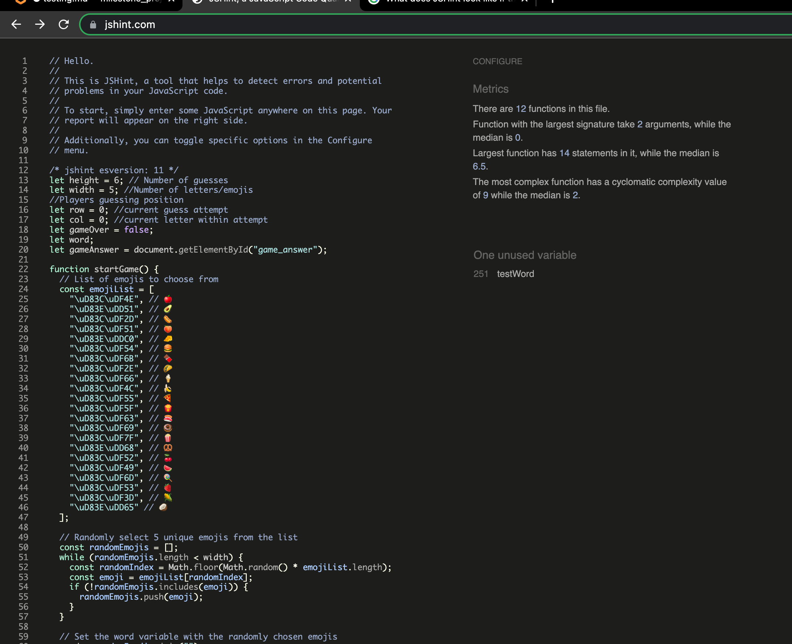 | Unused variables from external files |


## Browser Compatibility

I've tested my deployed project on multiple browsers to check for compatibility issues.

| Browser | Screenshot | Notes |
| --- | --- | --- |
| Chrome | 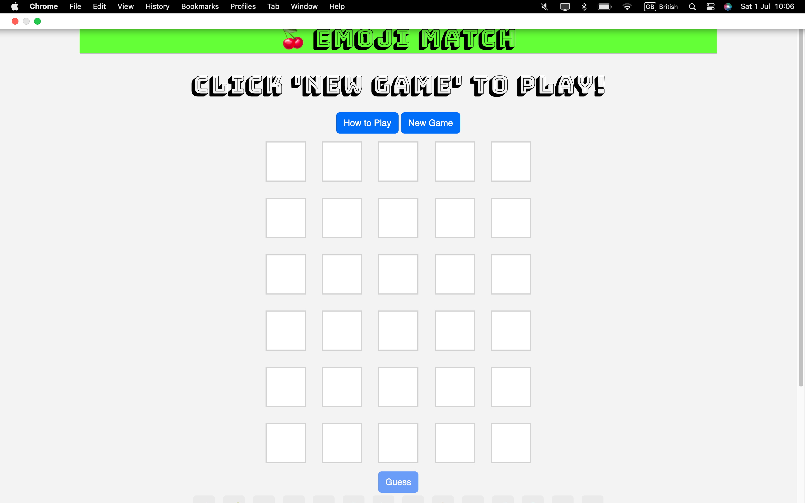 | Works as expected |
| Firefox | 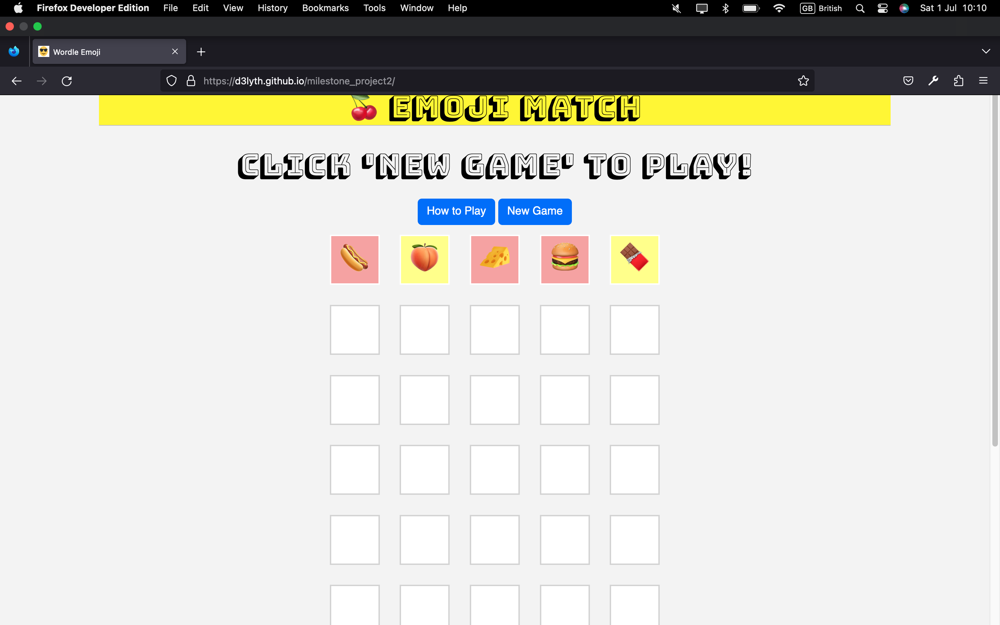 | Works as expected |
| Edge | 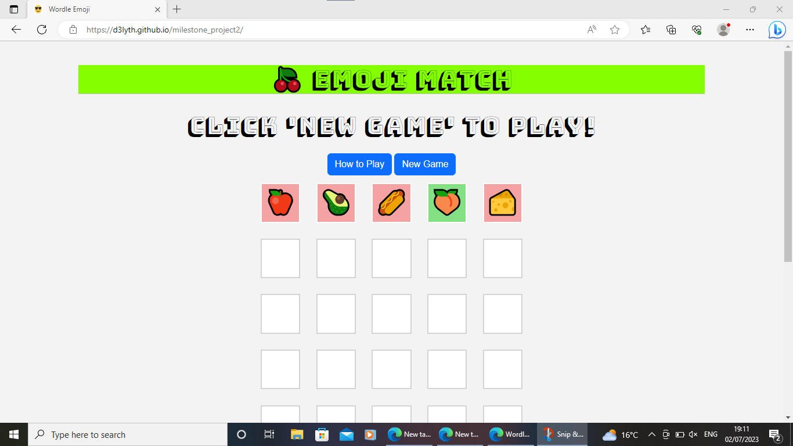 | Emojis look slightly different, but works as expected |
| Safari | 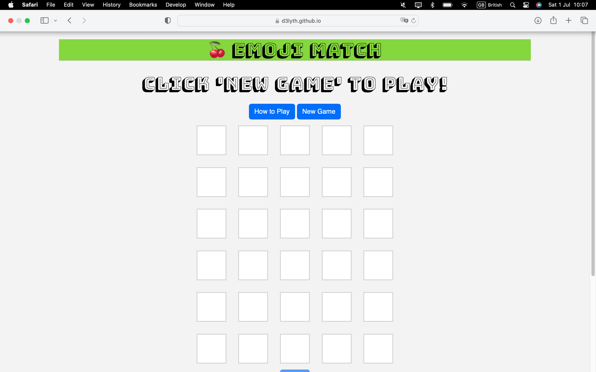 | Minor CSS differences |
| Brave | 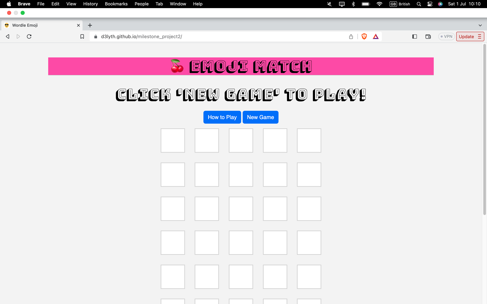 | Works as expected |
| Opera | 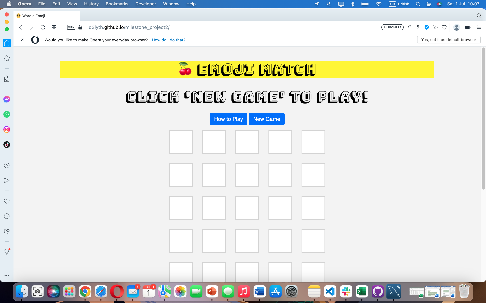 | Minor differences |
| Internet Explorer | No access to be able to test | N/A |

## Responsiveness

I've tested my deployed project on multiple devices to check for responsiveness issues.

| Device | Screenshot | Notes |
| --- | --- | --- |
| Mobile (DevTools) | 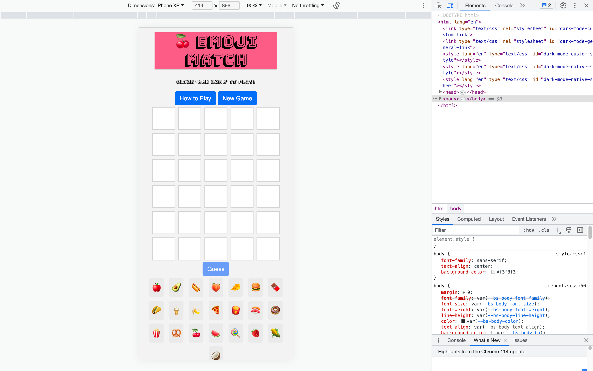 | Works as expected (iPhone XR setting) |
| Tablet (DevTools) | 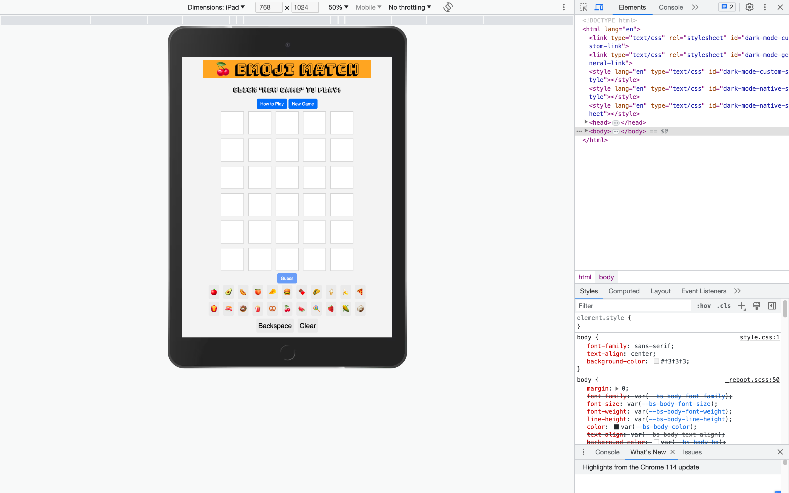 | Works as expected |
| Desktop (DevTools) | 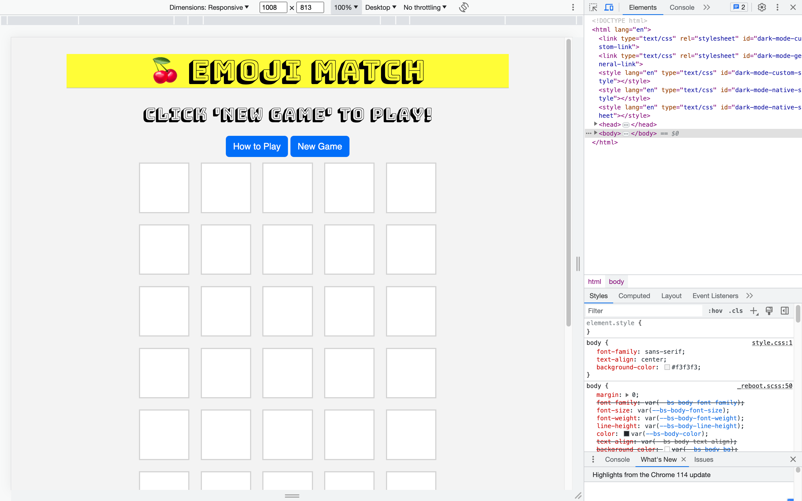 | Works as expected |
| Desktop | 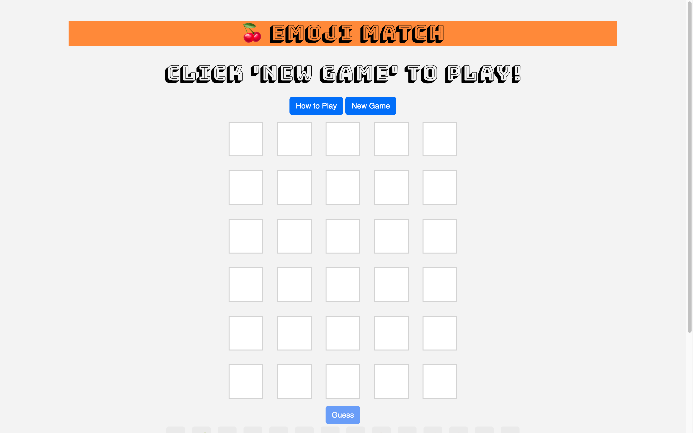 | Works as expected |
| iPhone 14 | 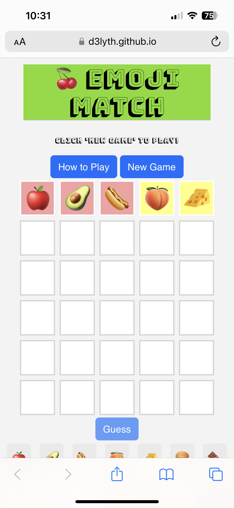 | Works as expected |
| iPad Air | 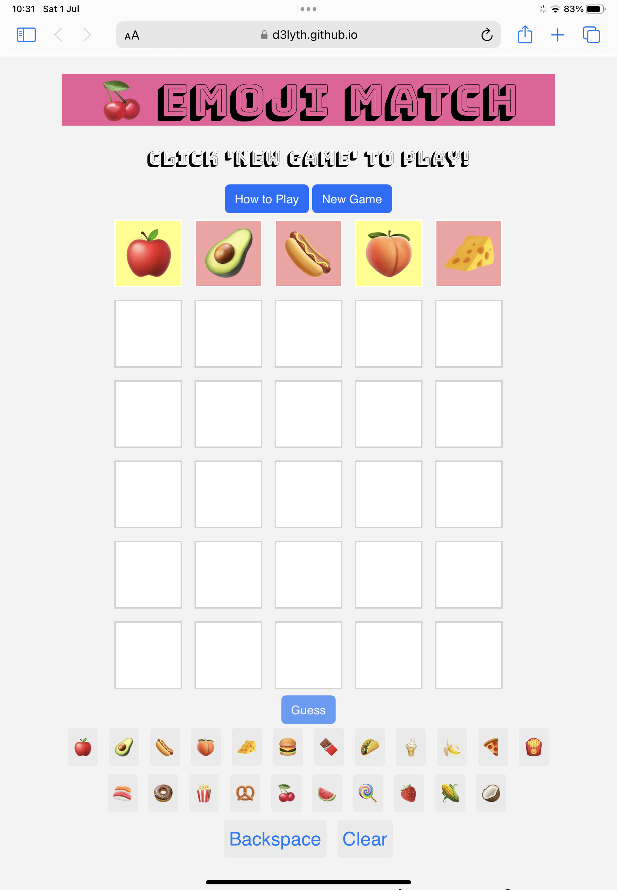 | Works as expected |

## Lighthouse Audit

I've tested my deployed project using the Lighthouse Audit tool to check for any major issues.

| Page | Size | Screenshot | Notes |
| --- | --- | --- | --- |
| Home | Mobile | 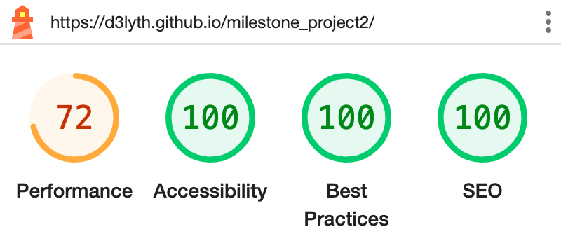 | Some minor warnings |
| Home | Desktop | 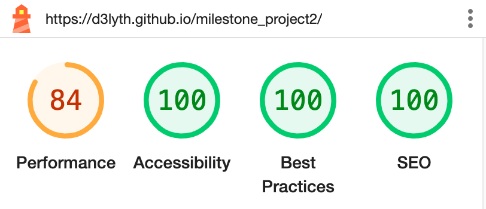 | Few minor warnings |

## Defensive Programming

Defensive programming was manually tested with the below user acceptance testing:

| Page | User Action | Expected Result | Pass/Fail | Comments |
| --- | --- | --- | --- | --- |
| Home Page | | | | |
| | Click on New Game | Will start a new game | Pass | |
| | Click on How to Play | Will open an instructions modal | Pass | |
| | Click on Guess | Will allow user to submit their guess | Pass | Will only be enabled if all 5 tiles in a row are filled|
| | Click on I got it! | Will close the instructions modal| Pass | |
| | Click on Backspace | Will remove an emoji from a tile if keyboard button is pressed bvy mistake | Pass | |
| | Click on Clear | Will remove all emojis from the row the user is currently on to allow a different combinations of emojis to selected before pressing guess | Pass | |
| | Click on any emoji key on keyboard | Will enter selected emoji in an empty tile | Pass | |
 
## User Story Testing

| User Story | Screenshot |
| --- | --- |
| As a new site user, I would like to click on the 'How to Play'button, so that I can check the instructions. This works as expected. |  |
| As a new site and returning user, I would like to click on the 'New Game' button, so that I can start a new game. This works as expected - button must be clicked at the beginning of EVERY new game. |  |
| As a new site and returning site user, I would like to see the gameboard, so that I can see which emojis I place into the tiles. This works as expected.| 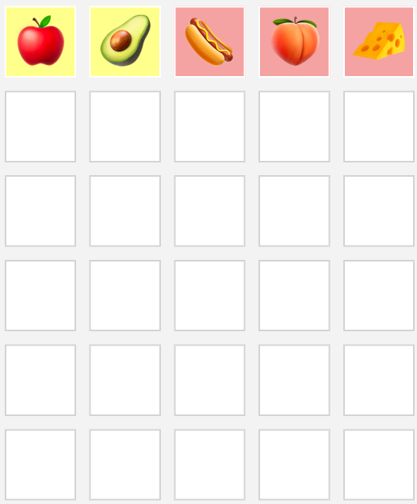 |
| As a new site and returning user, I would like to be able to use an on screen keyboard, so that I can select the emojis easily. This works as expected.| 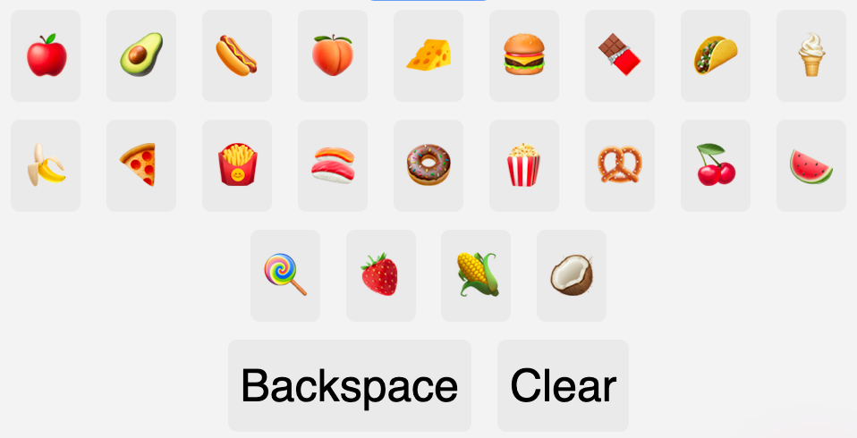 |
| As a new site and returning site user, I would like to click on a 'clear' button, so that I can remove all the emojis from a row of tiles if I have made aa mistaake whilst selecting the emojis.This works as expected. | 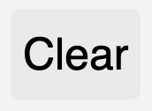 |
| As a new site and returning site user, I would like to click on the backspace button, so that I can delete an emoji that I may have selected by mistake .This works as expected. | 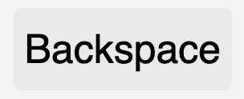 |
| As a new site and returning site user, I would like to click on the guess button, so that I can determine if my sequence of emojis is correct. This works as expected. | 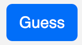 |
| As a new site and returning site user, I would like to see a 'well done' message, so that I can see that I have managed to complete the game and guess the sequence correctly. This works as expected. | 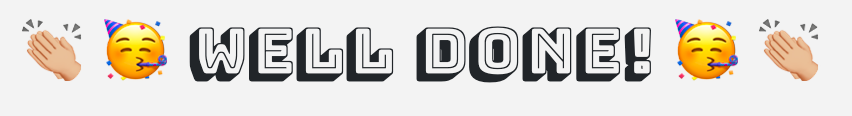 |
| As a new site and returning site user, I would like to see the correct answer at the end of the game, so that I can see that my answer matches or what the correct answer is if I fail get get the sequence correct in 6 guesses or less. This works as expected. | 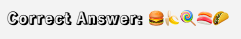 |
| As a new site and returning site user, I would like to see the 'game over' banner at the end of the game, so that I can see that the game has finished. This works as expected. | 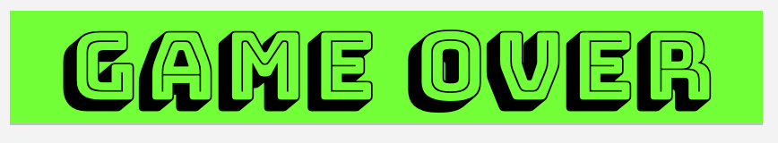 |

## Automated Testing

I have conducted a series of automated tests on my application.

I fully acknowledge and understand that, in a real-world scenario, an extensive set of additional tests would be more comprehensive.

### JavaScript (Jest Testing)

I have used the [Jest](https://jestjs.io) JavaScript testing framework to test the application functionality.

In order to work with Jest, I first had to initialize NPM.

- `npm init`
- Hit `enter` for all options, except for **test command:**, just type `jest`.

Add Jest to a list called **Dev Dependencies** in a dev environment:

- `npm install --save-dev jest`

**IMPORTANT**: Initial configurations

When creating test files, the name of the file needs to be `main.test.js` in order for Jest to properly work.

Due to a change in Jest's default configuration, you'll need to add the following code to the top of the `.test.js` file:

```js
/**
 * @jest-environment jsdom
 */

const { test, expect } = require("@jest/globals");
const { function1, function2, function3, etc. } = require("../script-name");

beforeAll(() => {
    let fs = require("fs");
    let fileContents = fs.readFileSync("index.html", "utf-8");
    document.open();
    document.write(fileContents);
    document.close();
});
```

Remember to adjust the `fs.readFileSync()` to the specific file you'd like you test.
The example above is testing the `index.html` file.

Finally, at the bottom of the script file where your primary scripts are written, include the following at the bottom of the file.
Make sure to include the name of all of your functions that are being tested in the `.test.js` file.

```js
if (typeof module !== "undefined") module.exports = {
    function1, function2, function3, etc.
};
```

Now that these steps have been undertaken, further tests can be written, and be expected to fail initially.
Write JS code that can get the tests to pass as part of the Red-Green refactor process.

Once ready, to run the tests, use this command:

- `npm test`

**NOTE**: To obtain a coverage report, use the following command:

- `npm test --coverage`

Below are the results from the tests that I've written for this application:

| Test Suites | Tests | Coverage | Screenshot |
| --- | --- | --- | --- |
| 1 passed | 16 passed | 55% | 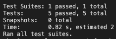 |
| x | x | x | repeat for all remaining tests |

#### Jest Test Issues

⚠️⚠️⚠️⚠️⚠️ START OF NOTES (to be deleted) ⚠️⚠️⚠️⚠️⚠️

Use this section to list any known issues you ran into while writing your Jest tests.
Remember to include screenshots (where possible), and a solution to the issue (if known).

This can be used for both "fixed" and "unresolved" issues.

## Bugs

- Chilli emoji was displaying incorrectly on certain devices and effecting gameplay (tiles were not changing to the correct colour).

    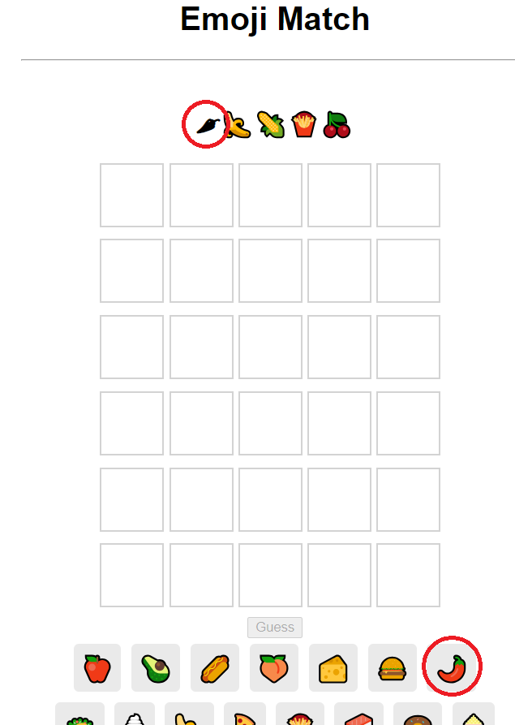

    - To fix this, I changed the chilli emoji to the ice cream emoji, and the game play was rectified.


- When clicking on "Guess" the gameAnswer appears empty and is not populated if "New Game" is not clicked when the page loads.

    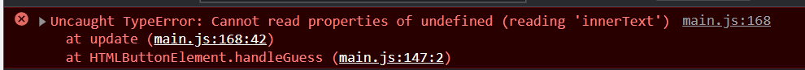

    - To fix this, I added the  ```startNewGame();``` function as a stand alone function call.

- When validating HTML element, the validator warns about an empty header.

    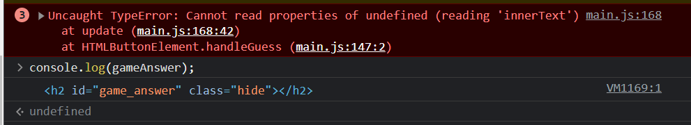


    - To fix this I filled the header with 5 random emojis - these emojis are hidden and the string will be  overwritten by the JS.

## Unfixed Bugs

- On devices smaller than 375px, the keys become too small to be able to use.

- When guesssing the emojis, if an emoji that is present is repeated, then if the tile of the one in the correct place turns green, the other turns yellow.

    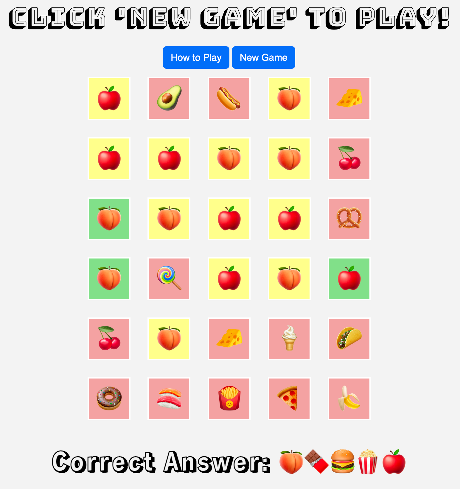

    - Attempted fix: I tried to add a futher functions to allow for repeat emojis to work in the code, but this bug remains.


- When playing with the game initially, an issue came up that the chilli emoji wasn't appearing correctly on some devices and wasn't matching up with the game in the correct manner.

    - Attempted re-inserting the unicode, but issue was not rectified. A different emoji was chosen instead. See 'Bugs' for further details.

Other that the points listed above, there are no remaining bugs that I am aware of.
